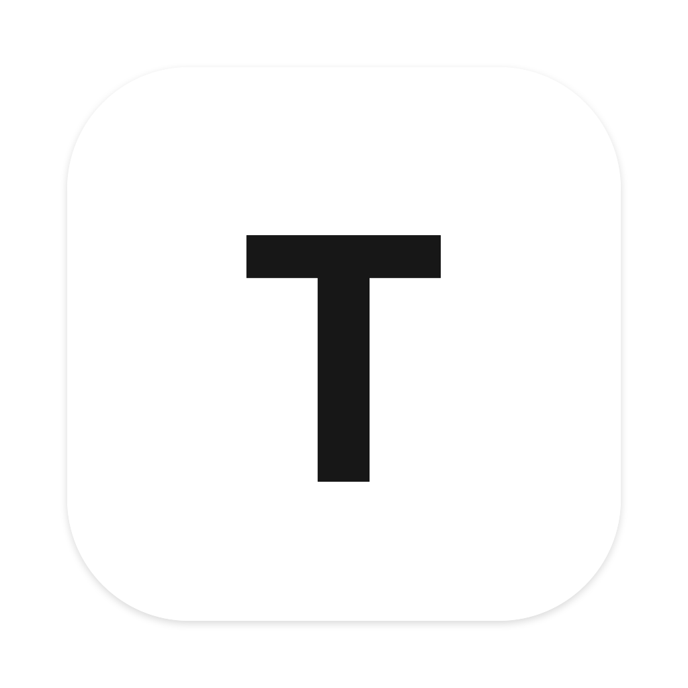

<p align="center">
  
</p>

<h1 align="center">Screen Translator</h1>

<p align="center"><strong>macOS screen translation · Full screen · Region select · Pixel-perfect overlay</strong></p>

<p align="center">
  <a href="https://github.com/Archer-SQ/screen-translator/releases"></a>
  <a href="https://github.com/Archer-SQ/screen-translator/blob/main/LICENSE"></a>
  
  
</p>

<p align="center">
  <a href="https://github.com/Archer-SQ/screen-translator/releases/latest">Download</a> · 
  <a href="https://archer-sq.github.io/screen-translator/">Website</a> · 
  <a href="./README.md">中文</a>
</p>

---

## What is this?

Screen Translator lets you translate any text on your macOS screen with one keypress — web pages, apps, games, settings, error messages. Translations are rendered in place, pixel-perfect, as if the app was natively localized.

Two modes:
- **Full screen** (`Shift+Z+X`) — translate the entire screen at once
- **Region select** (`Shift+Z+C`) — drag to select an area, translate only what you need

## Features

### Core
- **Two translation modes** — full-screen one-shot or region drag-select
- **Freeze frame** — screen freezes the moment you hit the hotkey, works on videos, games, animations
- **Pixel-perfect in-place overlay** — Canvas-rendered, matches original font size and background color
- **Multi-display** — automatically detects cursor display, translates that screen

### Overlay interactions
- **Drag from anywhere** — not limited to titlebar, grab the whole overlay to move
- **8-direction edge resize** — cursor auto-switches on edge hover
- **Trackpad pinch-to-zoom** — Apple gesture support
- **Double-click to close** — clean unified behavior
- **Always on top** — covers fullscreen apps

### OCR & Translation
- **2x2 quadrant OCR** — large screens split into 4 overlapping quadrants, parallel OCR for better accuracy
- **Contrast enhancement** — Core Image preprocessing for low-contrast text (terminals, dim UIs)
- **Vision Revision 3** — uses latest macOS OCR model
- **Multiple engines** — Google (free) / OpenAI / Anthropic / DeepL / Ollama
- **Translation cache** — `Shift+S` to save, instant redisplay on same content
- **Auto proxy** — reads macOS system proxy settings

### Privacy
- Everything runs locally, screenshots never leave your device
- API keys stored only in local config

## Installation

### Download

Get the latest DMG from [Releases](https://github.com/Archer-SQ/screen-translator/releases/latest), open it and drag to Applications.

**"Damaged" warning on first open?** The app is unsigned — run once in Terminal:
```bash
xattr -cr /Applications/Screen\ Translator.app
```

### Build from source

```bash
git clone https://github.com/Archer-SQ/screen-translator.git
cd screen-translator
npm install
npm run dev
```

Package as .app:
```bash
npx electron-builder --mac --dir
```

### Requirements

- macOS 13.0+ (Apple Silicon)
- **Screen Recording** permission
- **Accessibility** permission

## Shortcuts

| Shortcut | Action |
|----------|--------|
| `Shift + Z + X` | Full screen translate |
| `Shift + Z + C` | Region translate |
| `ESC` | Dismiss overlay / cancel |
| `Shift + S` | Save current translation to cache |

All shortcuts are customizable in Settings.

## Translation Providers

| Provider | API Key | Notes |
|----------|:---:|-------|
| **Google** | No | Built-in free, auto proxy |
| **OpenAI Compatible** | Yes | GPT-4o-mini, custom endpoint |
| **Anthropic Compatible** | Yes | Claude, MiniMax, etc. |
| **DeepL** | Yes | Premium European languages |
| **Ollama** | No | Local models, fully offline |

## How It Works

```
Hotkey → Capture → OCR + AX parallel → Filter → Batch translate → Canvas overlay
```

**Full screen**: capture full display → 2x2 quadrant OCR → dedupe → batch translate → render overlay

**Region**: freeze full display screenshot → show selection UI → user drags → crop → OCR → translate → draggable resizable result window

**Key tech**:
- macOS Vision framework OCR (zh-Hans / zh-Hant / ja / ko / en, etc.)
- Native CGEventTap global hotkeys
- Canvas direct drawing (font-size reverse inference, background sampling, overlay)
- Accessibility API for precise text positioning

## Project Structure

```
src/main/                Electron main process (TypeScript)
  index.ts               Translation flow orchestration
  screenshot.ts          Region screenshot (screencapture -R)
  ocr.ts                 OCR binary caller + 2x2 quadrant split
  accessibility.ts       AX API wrapper
  translator.ts          Translation service dispatcher
  providers/             google | openai | claude | deepl | ollama
  overlay.ts             Full-screen overlay window management
  region-overlay.ts      Region result overlay (draggable, resizable, multiple)
  selection.ts           Selection drawing window (frozen screenshot bg)
  hotkey.ts              Native hotkey process manager
  tray.ts                System tray menu

src/renderer/            Renderer layer (plain HTML/JS)
  overlay.html/js        Canvas-drawn full-screen overlay
  region-overlay.html/js Region result overlay
  selection.html/js      Region selection UI
  settings.html/js       Settings page (CN/EN bilingual)

scripts/                 Native macOS tools (Objective-C)
  ocr-macos.m            Vision OCR + Core Image contrast enhancement
  hotkey-macos.m         CGEventTap global hotkeys
  axtext-macos.m         Accessibility text reader
```

## License

MIT

## Acknowledgments

- [google-translate-api-x](https://github.com/AidanWelch/google-translate-api) — Free Google Translate
- [Electron](https://www.electronjs.org/) — Desktop framework
- Apple Vision Framework — Native OCR
